# Description

> 🗃️ All commands are created as **skills** (Claude Code proprietary format, new format for the **commands**) and are stored into this [folder](.claude/skills).

🧑‍💻 This folder contains coding assistant commands that I use to performa secure code review assistant with AI via the coding assistant (claude code in my context).

🔬 The idea is to:

1. Convert interesting proposals from the collection of proposals of this [project](https://github.com/righettod/code-snippets-security-utils) into **rules**.
2. Allow me to learn how to create instructions for a coding assistant (claude code here) to allow to create secure code at the implementation time.

# Review process

🔬 I imagined the following process against a codebase using claude code sessions:

🧑‍💻 Intital into a claude code session **at the root folder of the codebase**:

1. Start a new claude code session: *Important to isolate the processing from a context perspective*.
2. Call the command [`codebase-overview`](#case-1-codebase-overview) to have a global visual overview of the risky sinks.

🧑‍💻 For each module of the codebase into a claude code session **at the root folder of the module**, apply these steps:

1. Scan the code with [SemGrep](https://github.com/semgrep/semgrep) to identify issues using a pattern-based approach: Goal is to identify issues not linked to a entry point, like for example, a deprecated algorithm used but not called from an entry point.
2. Start a new claude code session: *Important to isolate the processing from a context perspective*.
3. Call the command [`codebase-semgrep-findings-review`](#case-3-review-the-semgrep-scan-of-the-codebase) to filter false positive findings from the SemGrep scan results.
4. Start a new claude code session: *Important to isolate the processing from a context perspective*.
5. Call the command [`codebase-hotspots`](#case-2-codebase-hotspots) to identify entry point that leads to risk processing from a security perspective.
6. Review and manually validate the result of step **3** + step **5**.

💡 A approach by module is used to speed-up the review.

💡 The SemGrep scan is performed via this dedicated [toolbox](https://github.com/righettod/toolbox-codescan).

# Origin of the creation of the skills based on different cases (context)

## Case 1: Codebase overview

🤔 In this case, the context is that I received a codebase and I want to use claude code to give me the following overview:

```text
A visual overview of the information entry points and where the information land including the type of processing
and if such processing can be risky from a security perspective.
```

📦 User prompt is stored, as `claude code command`, into the file in the folder `.claude/skills/codebase-overview/` ([ref](.claude/skills/codebase-overview/SKILL.md)).

🤖 Use it via this instruction inside a claude code session: `/codebase-overview [RELATIVE_PATH_TO_CODEBASE]`.

✅ The generated Mermaid code was validated using the [Mermaid Live](https://mermaid.live/) editor to check its rendering, readability, and the effectiveness of the generated diagram. The Mermaid format was chosen because it is a text-based format; it can therefore be modified after generation if necessary or sent to an LLM for additional analysis rounds.

ℹ️ Forms legend:

* **Hexagon** form represents a *entry* point.
* **Rectangle** form represents a custom code *landing* points with a TAG to indicate the type of processing performed and colored if such processing can be risky from a security perspective.
* **Circle** form represents a third-party library *landing* points and colored if processing performed can be risky from a security perspective.

ℹ️ Node label naming conventions is defined into the section **[Output rules](.claude/skills/codebase-overview/SKILL.md#output-rules)** section of the command file.

🔬 Example of generated schema against the source code of [OWASP WebGoat](https://github.com/WebGoat/WebGoat) using the download of a zip archive of the *main* branch:

```mermaid
flowchart LR
    MAIN{{"StartWebGoat#main"}} --> LIB_SB(("Spring Boot"))
    HH{{"HammerHead#attack"}} --> P_SESSION["org.owasp.webgoat.container.session -- SESSION"]:::med
    REG{{"RegistrationController#registration"}} --> P_USERS["org.owasp.webgoat.container.users -- USER-MGMT -> AUTHN"]:::med
    REGO{{"RegistrationController#registrationOAUTH"}} --> P_USERS
    RPT{{"ReportCardController#reportCard"}} --> P_USERS
    MENU{{"LessonMenuService#showLeftNav"}} --> P_USERS
    PROG{{"LessonProgressService#lessonOverview"}} --> P_USERS
    RESTART{{"RestartLessonService#restartLesson"}} --> LIB_FLYWAY(("Flyway")):::high
    ENVSVC{{"EnvironmentService#homeDirectory"}} --> P_ENV["org.owasp.webgoat.container.service -- CONFIG-EXPOSURE"]:::med
    LBLDBG{{"LabelDebugService#setDebuggingStatus"}} --> P_ENV
    LBL{{"LabelService#fetchLabels"}} --> P_I18N["org.owasp.webgoat.container.i18n -- METADATA/I18N"]
    HINT{{"HintService#getHints"}} --> P_I18N
    FS_IMP{{"FileServer#importFile"}} --> LIB_FILE(("java.io / java.nio (file I/O)")):::high
    FS_GET{{"FileServer#getFiles"}} --> LIB_FILE
    MAIL{{"MailboxController#sendEmail"}} --> LIB_MAIL(("Spring Mail"))
    WJWT_D{{"JWTController#decode"}} --> LIB_JJWT(("io.jsonwebtoken (jjwt)")):::med
    WJWT_E{{"JWTController#encode"}} --> LIB_JJWT
    VERIFY{{"VerifyAccount#completed"}} --> P_AUTHBYPASS["org.owasp.webgoat.lessons.authbypass -- AUTHN"]:::med
    A1{{"Assignment1#completed"}} --> P_CHAL["org.owasp.webgoat.lessons.challenges -- AUTHN -> ACCOUNT-RECOVERY"]:::med
    A7R{{"Assignment7#resetPassword"}} --> P_CHAL
    A8V{{"Assignment8#vote"}} --> P_CHAL
    IMG{{"ImageServlet#logo"}} --> LIB_FILE
    A5{{"Assignment5#login"}} --> LIB_JDBC(("java.sql / JDBC")):::high
    A7L{{"Assignment7#sendPasswordResetLink"}} --> LIB_REST(("Spring RestTemplate")):::med
    ENC{{"EncodingAssignment#completed"}} --> P_CRYPTO["org.owasp.webgoat.lessons.cryptography -- CRYPTO"]:::med
    HMD5{{"HashingAssignment#getMd5"}} --> LIB_CRYPTO(("java.security / javax.crypto")):::med
    HSHA{{"HashingAssignment#getSha256"}} --> LIB_CRYPTO
    SDEF{{"SecureDefaultsAssignment#completed"}} --> LIB_CRYPTO
    SIGN{{"SigningAssignment#completed"}} --> LIB_CRYPTO
    SIGNK{{"SigningAssignment#getPrivateKey"}} --> LIB_CRYPTO
    FR_R{{"ForgedReviews#retrieveReviews"}} --> P_CSRF["org.owasp.webgoat.lessons.csrf -- CSRF/STATE-CHANGE"]:::med
    FR_C{{"ForgedReviews#createNewReview"}} --> P_CSRF
    DESER{{"InsecureDeserializationTask#completed"}} --> LIB_OIS(("java.io.ObjectInputStream")):::high
    HIJACK{{"HijackSessionAssignment#login"}} --> P_HIJACK["org.owasp.webgoat.lessons.hijacksession.cas -- AUTHN -> SESSION"]:::med
    IDOR_V{{"IDORViewOtherProfile#completed"}} --> P_IDOR["org.owasp.webgoat.lessons.idor -- AUTHZ -> ACCESS-CONTROL"]:::med
    IDOR_E{{"IDOREditOtherProfile#completed"}} --> P_IDOR
    IDOR_O{{"IDORViewOwnProfile#invoke"}} --> P_IDOR
    IDOR_L{{"IDORLogin#completed"}} --> P_IDOR
    INSLOG{{"InsecureLoginTask#completed"}} --> P_INSLOG["org.owasp.webgoat.lessons.insecurelogin -- AUTHN"]:::med
    JWT_DEC{{"JWTDecodeEndpoint#decode"}} --> P_JWT["org.owasp.webgoat.lessons.jwt -- AUTHN -> SESSION"]:::med
    JWT_SK{{"JWTSecretKeyEndpoint#login"}} --> LIB_JJWT
    JWT_RF{{"JWTRefreshEndpoint#newToken"}} --> LIB_JJWT
    JWT_VT{{"JWTVotesEndpoint#vote"}} --> LIB_JJWT
    JWT_JKU{{"JWTHeaderJKUEndpoint#resetVotes"}} --> LIB_AUTH0(("com.auth0.jwt")):::med
    JWT_KID{{"JWTHeaderKIDEndpoint#resetVotes"}} --> LIB_JDBC
    JWT_KID --> LIB_JJWT
    LOGSP{{"LogSpoofingTask#completed"}} --> P_LOG["org.owasp.webgoat.lessons.logging -- LOG-INJECTION"]
    LOGBL{{"LogBleedingTask#completed"}} --> LIB_SLF4J(("slf4j"))
    MAC_L{{"MissingFunctionACUsers#listUsers"}} --> P_MAC["org.owasp.webgoat.lessons.missingac -- AUTHZ -> ACCESS-CONTROL"]:::med
    MAC_S{{"MissingFunctionACUsers#usersService"}} --> LIB_JDBC
    MAC_A{{"MissingFunctionACUsers#addUser"}} --> LIB_JDBC
    MAC_H{{"MissingFunctionACHiddenMenus#completed"}} --> P_MAC
    OR1{{"OpenRedirectTask1#simulate"}} --> P_REDIR["org.owasp.webgoat.lessons.openredirect -- REDIRECT"]:::med
    OR4{{"OpenRedirectTask4#doubleDecode"}} --> P_REDIR
    ORR{{"OpenRedirectRealRedirect#real"}} --> P_REDIR
    PWL{{"ResetLinkAssignment#login"}} --> P_PWR["org.owasp.webgoat.lessons.passwordreset -- ACCOUNT-RECOVERY"]:::med
    PWC{{"ResetLinkAssignment#changePassword"}} --> P_PWR
    PWQ{{"SecurityQuestionAssignment#completed"}} --> P_PWR
    PWSML{{"SimpleMailAssignment#login"}} --> P_PWR
    PWSEND{{"ResetLinkAssignmentForgotPassword#sendPasswordResetLink"}} --> LIB_REST
    PU_UP{{"ProfileUpload#uploadFileHandler"}} --> LIB_FILE
    PU_GET{{"ProfileUpload#getProfilePicture"}} --> LIB_FILE
    PUF_UP{{"ProfileUploadFix#uploadFileHandler"}} --> LIB_FILE
    PUR_GET{{"ProfileUploadRetrieval#getProfilePicture"}} --> LIB_FILE
    PZ_UP{{"ProfileZipSlip#uploadFileHandler"}} --> LIB_ZIP(("java.util.zip")):::high
    PZ_GET{{"ProfileZipSlip#getProfilePicture"}} --> LIB_FILE
    SECPW{{"SecurePasswordsAssignment#completed"}} --> LIB_ZXCVBN(("Zxcvbn"))
    ACT_E{{"ActuatorExposureTask#actuatorEnv"}} --> P_SECMC["org.owasp.webgoat.lessons.securitymisconfiguration -- CONFIG-EXPOSURE"]:::med
    ACT_K{{"ActuatorExposureTask#submitApiKey"}} --> P_SECMC
    SPOOF{{"SpoofCookieAssignment#login"}} --> P_SPOOF["org.owasp.webgoat.lessons.spoofcookie -- SESSION -> CRYPTO"]:::med
    SQL2{{"SqlInjectionLesson2#completed"}} --> LIB_JDBC
    SQL5{{"SqlInjectionLesson5#completed"}} --> LIB_JDBC
    SQL8{{"SqlInjectionLesson8#completed"}} --> LIB_JDBC
    SQL10{{"SqlInjectionLesson10#completed"}} --> LIB_JDBC
    SQL13{{"SqlInjectionLesson13#completed"}} --> LIB_JDBC
    SQLC{{"SqlInjectionChallenge#registerNewUser"}} --> LIB_JDBC
    SQLCL{{"SqlInjectionChallengeLogin#login"}} --> LIB_JDBC
    SQL6A{{"SqlInjectionLesson6a#completed"}} --> LIB_JDBC
    SQLIV{{"SqlOnlyInputValidation#attack"}} --> LIB_JDBC
    SQL10B{{"SqlInjectionLesson10b#completed"}} --> LIB_JAVAC(("javax.tools.JavaCompiler")):::high
    VULN{{"VulnerableComponentsLesson#completed"}} --> LIB_XSTREAM(("XStream")):::high
    XSS5{{"CrossSiteScriptingLesson5a#completed"}} --> P_XSS["org.owasp.webgoat.lessons.xss -- XSS-SINK"]
    XSS_ST{{"StoredXssComments#retrieveComments"}} --> P_XSS
    XSS3{{"CrossSiteScriptingLesson3#completed"}} --> LIB_JSOUP(("Jsoup"))
    XXE_S{{"SimpleXXE#createNewComment"}} --> LIB_XML(("javax.xml (StAX/XXE)")):::high
    XXE_B{{"BlindSendFileAssignment#addComment"}} --> LIB_XML
    XXE_C{{"ContentTypeAssignment#createNewUser"}} --> LIB_XML
    XXE_R{{"CommentsEndpoint#retrieveComments"}} --> P_XXE["org.owasp.webgoat.lessons.xxe -- XML-PARSE"]:::high
    SSRF2{{"SSRFTask2#completed"}} --> LIB_NET(("java.net.URL")):::high
    classDef high fill:#fdd,stroke:#c00,color:#900
    classDef med fill:#ffe9c7,stroke:#e08e00
```



## Case 2: Codebase hotspots

🤔 In this case, the context is that I received a codebase and I want to use claude code to give point to code that does risky processing from a security perspective (called **hotspot*).

📦 User prompt is stored, as `claude code command`, into the file in the folder `.claude/skills/codebase-hotspots/` ([ref](.claude/skills/codebase-hotspots/SKILL.md)).

🤖 Use it via this instruction inside a claude code session: `/codebase-hotspots [RELATIVE_PATH_TO_CODEBASE]`.

### Case 3: Review the SemGrep scan of the codebase

🤔 In this case, I scanned the codebase with SemGrep to identify issues not linked to a entry point, like for example, a deprecated algorithm used but not called from an entry point.

📦 User prompt is stored, as `claude code command`, into the file in the folder `.claude/skills/codebase-semgrep-findings-review/` ([ref](.claude/skills/codebase-semgrep-findings-review/SKILL.md)).

🤖 Use it via this instruction inside a claude code session: `/codebase-semgrep-findings-review [PATH_TO_SEMGREP_REPORT] [RELATIVE_PATH_TO_CODEBASE] [MINIMUM_CONFIDENCE_LEVEL]`.

💡 `[MINIMUM_CONFIDENCE_LEVEL]`: Minimum confidence threshold for inclusion in output, accepted values are:

* `CONFIRMED`: Only confirmed findings.
* `PARTIAL`: Confirmed + needs-human-review findings.
* Default: `PARTIAL` - `FALSE_POSITIVE` verdicts are always excluded from the findings list but are recorded in the summary table.

# Compatibility note

⚠️ The `SKILL.md` files use the **Claude Code skill format** (Anthropic proprietary) and cannot be validated with [`skills-ref`](https://pypi.org/project/skills-ref/) (`pip install skills-ref`), which enforces the [agentskills.io open specification](https://agentskills.io/specification). Claude Code-specific frontmatter fields (`argument-hint`, `disable-model-invocation`, etc.) are not allowed by that specification.

# Install

🧑‍💻 Copy the folder [.claude/skills](.claude/skills/) folder into the `.claude` folder to the project to review and use *commands* from a claude code session.

# References

* <https://github.com/semgrep/semgrep>
* <https://en.wikipedia.org/wiki/Sink_(computing)>
* <https://breachforce.net/source-and-sinks>
